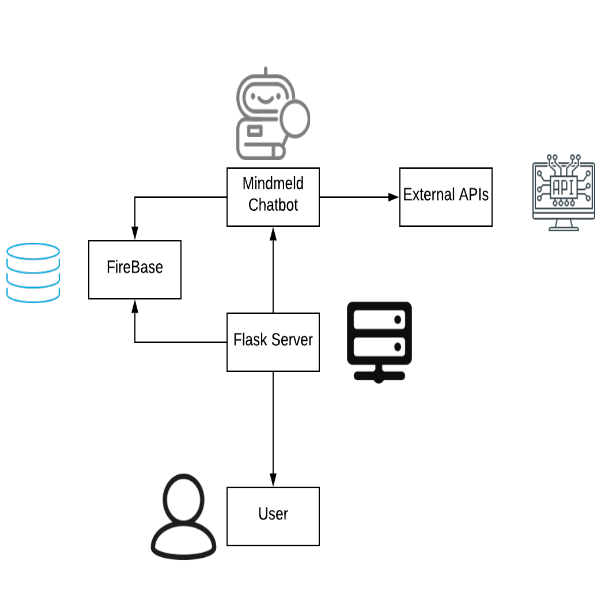

# atithi

## Overview
A digital solution to power the Indian Tourism Industry with the help of AI powered chatbot.

The project is developed at the Smart India Hackathon Grand Finale'20 as a solution to the problem statement propesed by the CISCO DEVNET.

The chatbot uses Mildmeld Library to process the NLP to recognize the intents and domain of the user query. We integrated the chatbot with Whatsapp with the Twilio SDK.

The chatbot is enabled with functionality to perform:
- Place Suggestion
- Hotel Suggestion and Booking
- Food Suggestion
- SOS 
- Itinerary Creation
- Expense Manager

## Mentions
The project got featured in Mindmeld's official Youtube and Medium account.

Find the links here
[Medium](https://medium.com/mindmeld/conversational-ai-at-smart-india-hackathon-2020-1793dfa0b574#SIH2020), [Youtube](https://youtu.be/ajJq2KRostM)


## Getting Started

### Authoriztion Keys and Credentials

The projects uses many API's to perform different tasks. Proper credentials must be entered beforehand.

#### AWS Credentials (For S3 Bucket)
Enter the valid key values in itinerary/config.py
#### Cloudinary Credentials 
Enter the valid key values in itinerary/config.py

#### Twilio Credentials
Enter the valid key values in main.sh


### Installation

Use Linux as the development environment.
Clone the repository and follow these steps.

Install Docker

Create a Virtual Environment and activate it.
````
virtualenv -p python3 .
source bin/activate
````
Install dependencies
````
pip install mindmeld
pip install mindmeld[bot]
pip install -r requirements.txt
````
Pull docker images and start container
```
sudo docker pull docker.elastic.co/elasticsearch/elasticsearch:6.7.0
sudo docker run -d -p 9200:9200 -p 9300:9300 -e "discovery.type=single-node" docker.elastic.co/elasticsearch/elasticsearch:6.7.0
```
or
```
docker pull mindmeldworkbench/duckling:master
docker run -p 0.0.0.0:7151:7151 mindmeldworkbench/duckling:master -ti -d
```
start num-parse
```
mindmeld num-parse --start
```
Run SH file
````
run ./main.sh
````


## Architecture


